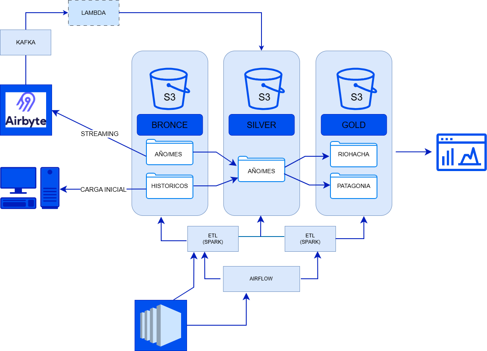

# Pipeline de Ingeniería de Datos para Análisis de datos climaticos.

Este proyecto implementa un pipeline completo de ingeniería de datos diseñado para analizar el comportamiento del potencial energético renovable a partir de datos meteorológicos.

El sistema ingiere datos climáticos desde una API externa, los procesa mediante Apache Spark, los orquesta con Apache Airflow y almacena los resultados en un Data Lake en Amazon S3 siguiendo una arquitectura por capas Bronze / Silver / Gold.

Además, el proyecto incorpora Kafka para ingestión de datos en streaming, infraestructura desplegada en AWS EC2 y validación automática del código mediante CI/CD con GitHub Actions.

El objetivo final es generar datasets analíticos que permitan estudiar el potencial solar y eólico de dos diferentes regiones geográficas (Patagonia y Rio Hacha).

## Arquitectura del Pipeline



El flujo de datos implementado en el proyecto sigue la siguiente arquitectura:

API meteorológica
↓
Kafka (Streaming)
↓
Bronze Layer – Datos crudos (S3)
↓
Spark ETL
↓
Silver Layer – Datos limpios (S3)
↓
Spark Aggregations
↓
Gold Layer – Métricas analíticas (S3)

La ejecución del pipeline es coordinada mediante Apache Airflow.

## Arquitectura del Data Lake

El Data Lake se implementa en Amazon S3 siguiendo un modelo por capas.

- Bronze: Capa de ingestión. s3://pi4.bronce/
Contiene los datos exactamente como llegan desde las fuentes externas.

Características:
Archivos JSON crudos
Sin transformaciones
Permite trazabilidad completa

- Silver: Capa de procesamiento. s3://pi4.silver

En esta etapa se realizan las siguientes transformaciones:
limpieza de datos
normalización de esquemas
conversión de tipos de datos
integración de datos históricos y de streaming
Los datos se almacenan en formato Parquet.
Particionamiento utilizado:location / year / month

- Gold: Capa analítica. s3://pi4.gold/

Contiene datasets agregados listos para responder preguntas de negocio.

Ejemplos de datasets generados:
climate_impact/
daily_energy_rank/
energy_metrics/
max_energy/
min_energy/
solar_potential/
wind_patterns/
wind_potential/


## Preguntas de Negocio

El pipeline fue diseñado para responder las siguientes preguntas analíticas:

¿Cómo varía el potencial solar estimado en diferentes regiones?

¿Qué patrones históricos existen en el potencial eólico?

¿Qué condiciones climáticas reducen el potencial energético?

¿Cómo se comportan las predicciones meteorológicas frente a los datos observados?

¿Qué periodos presentan mayor o menor potencial energético?

Estas preguntas se responden utilizando los datasets de la capa Gold.

## Tecnologías Utilizadas

El pipeline fue desarrollado utilizando el siguiente stack tecnológico.

- Almacenamiento
Amazon S3

alta durabilidad

escalabilidad prácticamente ilimitada

bajo costo

- Procesamiento

Apache Spark (PySpark)

Permite realizar transformaciones distribuidas sobre grandes volúmenes de datos.

Streaming

Apache Kafka

Utilizado para ingestión de datos en tiempo real.

- Orquestación

Apache Airflow

Se encarga de:

programar el pipeline

gestionar dependencias entre tareas

manejar reintentos en caso de error

monitorear ejecuciones

- Infraestructura

AWS EC2

Se utilizan instancias EC2 para ejecutar:

el nodo de Spark

el nodo de Airflow

CI/CD

GitHub Actions

El proyecto incluye un pipeline de integración continua que valida automáticamente:

estilo de código (Flake8)
tests de PySpark
ejecución del script ETL
construcción de la imagen Docker

## Estructura del Proyecto

```text

project
│
├── script_kafka
│   └── weather_producer.py
│   Código encargado de la ingestión de datos meteorológicos hacia Kafka
│
├── script_spark
│   ├── silver_weather_etl.py
│   └── gold_weather_metrics.py
│   Scripts de transformación y generación de datasets analíticos
│
├── script_airflow
│   └── dags
│       └── spark_remote_etl.py
│   Definición del DAG que orquesta el pipeline
│
├── test
│   └── test_spark_transform.py
│   Pruebas unitarias para validar transformaciones de Spark
│
├── requirements.txt
│   Dependencias del proyecto
│
├── Dockerfile
│   Configuración para ejecutar el proyecto en contenedor
│
├── launch_spark_airflow.ps1
│   Script para desplegar infraestructura en AWS
│
├── Docs
│   └──Avances.ipynb
│      DOcumentacion de los avances 
│
└── README.md

```